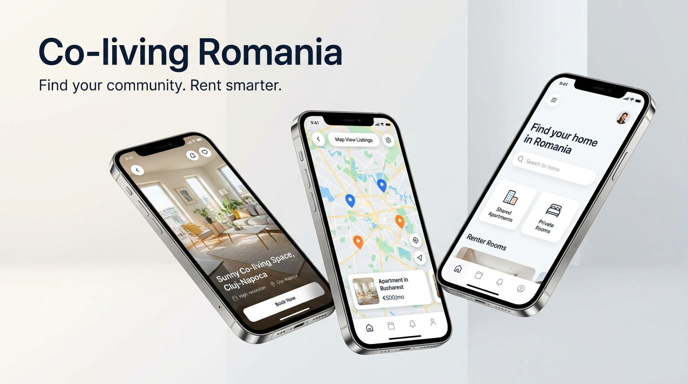

# RO-Rent

=======
# 🏡 Property Rental & Booking App (PFE)

A comprehensive, cross-platform property rental and booking application built with **Flutter** and **Firebase**. This project serves as a complete solution for finding, booking, and hosting properties, featuring real-time chat, interactive maps, and a modern UI.

*This project was developed as a Final Year Project (Projet de Fin d'Études - PFE).*

## ✨ Features

*   **🔐 Authentication & Profiles:** Secure email/password and social login using Firebase Authentication. Separate flows for Renters and Hosts.
*   **🔍 Search & Discover:** Advanced property search with filtering options.
*   **🗺️ Interactive Maps:** Browse properties on a map using `flutter_map`.
*   **📅 Booking Management:** Seamlessly book properties, manage upcoming trips, and view booking history.
*   **💬 Real-time Chat:** Instant messaging between hosts and renters using Firebase Realtime Database.
*   **🔔 Notifications:** Stay updated with booking statuses and new messages.
*   **🌍 Multi-language Support:** Easily switch between languages (localization built-in).
*   **🌓 Theming:** Beautiful Light and Dark modes using Material 3 design and Google Fonts (Plus Jakarta Sans).
*   **💾 Offline Caching:** Fast local storage using Hive for user settings and preferences.

## 🛠️ Tech Stack & Architecture

*   **Frontend:** Flutter & Dart
*   **State Management:** BLoC (Business Logic Component)
*   **Backend as a Service:** Firebase
    *   *Firebase Auth* (User Identity)
    *   *Firebase Realtime Database* (Chat & Dynamic Data)
    *   *Firebase Storage* (Property Images & Avatars)
*   **Local Storage:** Hive
*   **Architecture:** Feature-driven architecture (Clean Architecture principles) ensuring scalable and maintainable code.

## 📂 Project Structure

The project follows a clean, feature-first folder structure:

```text
lib/
 ├── core/           # Shared widgets, themes, models, and utils
 ├── features/       # Independent feature modules
 │    ├── auth/             # Authentication & Sign up
 │    ├── booking/          # Booking flow and management
 │    ├── chat/             # Real-time messaging
 │    ├── home/             # Main dashboard
 │    ├── host/             # Host dashboard and listing creation
 │    ├── notifications/    # Push and in-app notifications
 │    ├── onboarding/       # Splash screens and language selection
 │    ├── profile/          # User profile management
 │    ├── property_details/ # Detailed view of listings
 │    └── search/           # Search and filter logic
 └── main.dart       # App entry point
```

## 🚀 Getting Started

### Prerequisites

*   [Flutter SDK](https://docs.flutter.dev/get-started/install) (Version 3.8.0 or higher)
*   [Dart SDK](https://dart.dev/get-dart)
*   Firebase project setup (You need to provide your own `firebase_options.dart` and `google-services.json` / `GoogleService-Info.plist`)

### Installation

1. **Clone the repository:**
   ```bash
   git clone https://github.com/yourusername/MyPFE.git
   cd MyPFE
   ```

2. **Install dependencies:**
   ```bash
   flutter pub get
   ```

3. **Configure Firebase:**
   * Create a new project in the [Firebase Console](https://console.firebase.google.com/).
   * Register your Android and iOS apps.
   * Run `flutterfire configure` at the root of the project to generate the `firebase_options.dart` file.

4. **Run the app:**
   ```bash
   flutter run
   ```

## 📜 Scripts & Utilities

The project includes several backend seed and utility scripts (Node.js & Python) for database management:
*   `seed.js` / `seed2.js` / `seed3.js` / `seed4.js`: Scripts to populate the database with initial mock data.
*   `update_mylisting.py` / `update_renter_booking.py` / `modify_chat.py`: Python scripts for database migrations and testing.

## 🤝 Contributing

Contributions, issues, and feature requests are welcome! Feel free to check the [issues page](https://github.com/yourusername/MyPFE/issues).

## 📄 License

This project is licensed under the MIT License - see the [LICENSE](LICENSE) file for details.

